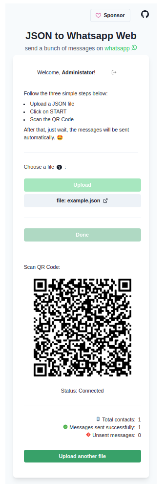

<br />
<div align="center">
  <a href="https://github.com/evertonpavan/json-to-whatsapp-web">
    
  </a>

<h3 align="center">JSON to Whatsapp Web</h3>

  <p align="center">
   Send a bunch of messages on Whatsapp Web from a JSON file
    <br />
    <!-- <a href="https://github.com/evertonpavan/json-to-whatsapp-web"><strong>Explore the docs »</strong></a>
    <br /> -->
    <br />
    <!-- <a href="https://github.com/evertonpavan/json-to-whatsapp-web">View Demo</a>
    · -->
    <a href="https://github.com/evertonpavan/json-to-whatsapp-web/issues">Report Bug</a>
    ·
    <a href="https://github.com/evertonpavan/json-to-whatsapp-web/issues">Request Feature</a>
  </p>
</div>

## The Project

<div align="center"> 
  
</div>

<br />

## Technologies/Libraries

### Client
-   [React](https://github.com/expressjs/express)
-   [Vite](https://github.com/expressjs/express)
-   [TypeScript](https://www.typescriptlang.org)
-   [Chakra UI](https://chakra-ui.com/)
-   [React Hook Form](https://react-hook-form.com/)
-   [Yup](https://www.npmjs.com/package/yup)
-   [Socket.io-client](https://www.npmjs.com/package/socket.io-client)

### Server
-   [Node.js](https://github.com/expressjs/express)
-   [Express](https://github.com/expressjs/express)
-   [TypeScript](https://www.typescriptlang.org)
-   [Whatsapp-web.js](https://github.com/pedroslopez/whatsapp-web.js)
-   [SocketIO](https://socket.io/)
-   [Zod](https://github.com/colinhacks/zod)
-   [Prisma](https://www.prisma.io/)

### Database
-   [PostgreSQL](https://www.postgresql.org/)


## Getting Started

This is an example of how you may give instructions on setting up your project locally.
To get a local copy up and running follow these simple example steps.

## Installation

### Run Locally

####  Server
1. Download or clone this repo.
2. Enter in server folder
3. Execute `yarn install` to install the dependencies.
4. Copy `.env.example` to `.env` and set the environment variables.
5. Start the database container:
  ```
  docker-compose up -d jsontoww-database
  ```
6. Start the development server:
  ```
  yarn dev
  ```
7. Run migrations
  ```
  npx prisma migrate dev
  ```
8. Run seeds
  ```
  npx prisma db seed
  ```

####  Web
1. Download or clone this repo.
2. Enter in web folder
3. Execute `yarn install` to install the dependencies.
4. Copy `.env.example` to `.env` and set the environment variables.
5. Start the development server:
  ```
  yarn run dev
  ```

### Docker Compose

####  Server
1. Download or clone this repo.
2. Copy `server/.env.example` to `server/.env` and set the environment variables.
3. Start the database container:
  ```
  docker-compose server/docker-compose.yml up -d jsontoww-database
  ```
4. Start the development container:
  ```
  docker-compose server/docker-compose.yml up -d jsontoww-server
  ```

####  Web
1. Download or clone this repo.
2. Copy `web/.env.example` to `web/.env` and set the environment variables.
3. Start the development server:
  ```
  docker-compose web/docker-compose.yml up -d
  ```

## Roadmap

- [ ] Add unit and integration tests 
- [ ] Fix mobile layout


## Contributing

Contributions are welcome and encouraged! To contribute, please follow these steps:

1. Fork the repository
2. Create a new branch
3. Make your changes
4. Push your changes to your fork
5. Submit a pull request

## Supporting the project

You can support the maintainer of this project through the link below:

- [Support via GitHub Sponsors](https://github.com/sponsors/evertonpavan)

And give a :star: if this project helped you!

## License

JSON to Whatsapp Web is released under the MIT [License](LICENSE).

## Disclaimer

This project is not affiliated, associated, authorized, endorsed by, or in any way officially connected with WhatsApp or any of its subsidiaries or its affiliates. The official WhatsApp website can be found at https://whatsapp.com. "WhatsApp" as well as related names, marks, emblems and images are registered trademarks of their respective owners.

This is an independent and unofficial software.

I can't guarantee or can be held responsible if you get blocked or banned by using this software. WhatsApp does not allow bots using unofficial methods on their platform, so this shouldn't be considered totally safe.

## Contact

Email: everton.pavan.dev@gmail.com

LinkedIn: [evertonpavan](https://www.linkedin.com/in/evertonpavan/) 